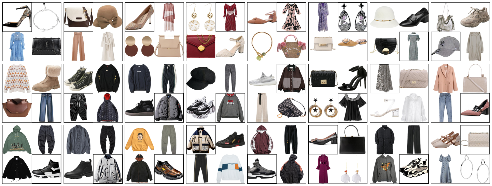
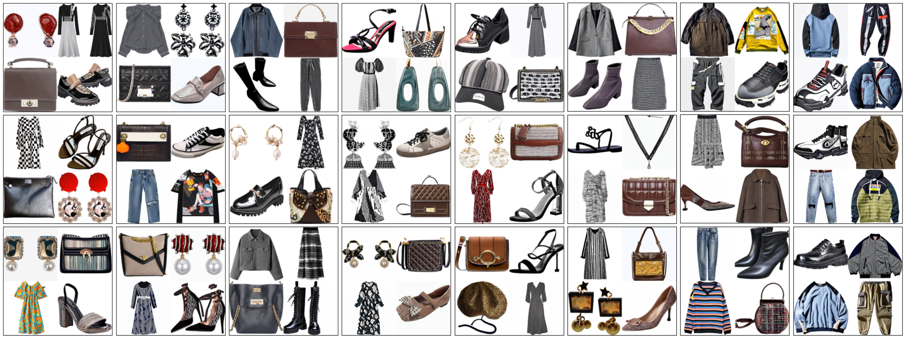

# Diffusion Models for Generative Outfit Recommendation
This is the pytorch implementation of our paper at SIGIR 2024:
> [Diffusion Models for Generative Outfit Recommendation](https://arxiv.org/abs/2402.17279)
> 
> Yiyan Xu, Wenjie Wang, Fuli Feng, Yunshan Ma, Jizhi Zhang, Xiangnan He

## DiFashion Overview
An overview of DiFashion: it gradually corrupts outfit images with Gaussian noise in the forward process, followed by a parallel conditional denoising process to reconstruct these images. The denoising process is guided by three conditions: category prompt, mutual condition, and history condition.


## Generated Examples
- Generated images (enclosed in small black squares within each outfit) for the PFITB task.

- Generated outfits for the GOR task.


## Environment
- Anaconda 3
- python 3.8.13
- torch 2.0.1
- torchvision 0.15.2
- Pillow 9.0.1
- numpy 1.24.4
- transformers 4.32.1
- open-clip-torch 2.20.0
- accelerate 0.20.3
- diffusers 0.18.2
- xformers 0.0.22
- pytorch-fid 0.3.0
- lpips 0.1.4

## Usage
### Dataset
The experimental data are in './datasets' folder, including iFashion and Polyvore-U. Each dataset consists of the following files:
- **`train.npy`:** dict with four keys `uids`, `oids`, `outfits`, and `category` for training. 
    ```python
    {
        'uids':[uid1,...],  # list of user ids
        'oids':[[oid1,...],...],  # user interacted outfit ids
        'outfits':[[[iid1,iid2,iid3,iid4],...],...],  # item ids within each interacted outfit
        'category':[[[cid1,cid2,cid3,cid4],...],...]  # category ids within each interacted outfit
    }
    ```
- **`valid_grd_dict.npy` & `test_grd_dict.npy`:** same data format as `train.npy`.
- **`fitb_valid.npy` & `fitb_test.npy`:** same data format as `train.npy` for validation and test, respectively. For the Fill-In-The-Blank task, we randomly set one item id of each outfit to be `0`, indicating the missing item that needs to be filled in.
- **`fitb_valid_dict.npy` & `fitb_test_dict.npy`:** another format of `fitb_valid.npy` and `fitb_test.npy`.
    ```python
    {
        uid1:{
            oid1:[iid1,iid2,iid3,iid4],
            oid2:[...],
            ...
        },
        ...
    }
    ```
- **`valid_grd.npy` & `test_grd.npy`:** ground-truth outfit information of each oid within validation and test sets.
    ```python
    {
        oid1:{
            'outfits':[iid1,iid2,iid3,iid4],
            'category':[cid1,cid2,cid3,cid4]
        },
        ...
    }
    ```
- **`fitb_valid_retrieval_candidates.npy` & `fitb_test_retrieval_candidates.npy`:** we randomly sample 4 items from the item set to serve as negative samples, which are combined with the ground-truth item to form the entire candidate set for each outfit in `fitb_valid.npy` and `fitb_test.npy` for retrieval.
    ```python
    {
        uid1:{
            oid1:[cand1,cand2,cand3,cand4,cand5]  # cand1 is the ground-truth
            oid2:[...],
            ...
        },
        ...
    }
    ```
- **`train_history.npy`, `valid_history.npy` & `test_history.npy`:** user interacted category id and corresponding item id.
    ```python
    {
        uid1:{
            cid1:[iid1,iid2,...],  # user interacted items within category cid1
            cid2:[...],
            ...
        },
        ...
    }
    ```
- **`id_cate_dict.npy`:** category id and corresponding semantic category.
    ```python
    {0:'skirt', 1:"women's canva shoe", ...}
    ```
- **`cate_iid_dict.npy` & `iid_cate_dict.npy`:** the correspondance between category id and item id.
- To acquire additional data, kindly retrieve the necessary files from from [iFashion-cloud](https://drive.google.com/file/d/1VOCEEo_r_HZrgkWpFzXidsrDHVyha5YI/view?usp=drive_link) and [Polyvore-cloud](https://drive.google.com/file/d/1-QkF04nnU9D8v4tMliBql5GUkqwmS8wt/view?usp=drive_link) and put them into corresponding data path, respectively. Each source comprises two files and one folder.
    
    - **`/processed`:** data processed for training, validation, test and evaluation. If you didn't download the files in the folder, 
    
        - You can set the argument '--data_processed' to False in `/DiFashion/train.py`, which will initiate the processing of above base data into a suitable format and save them in the folder '/datasets/dataset_name/processed'.
        - Run the code '/Evaluation/extract_hist_embs.py' to obtain the remaining files required for evaluation.

    - **`all_item_image_paths.npy`:** list of item image paths arranged according to item ids.
    - **`cnn_features_clip.npy`:** extracted clip image embeddings of all the images arranged according to item ids. You can find relevant code in '/Evaluation/extract_hist_embs.py'. 

For item images of [iFashion](https://github.com/wenyuer/POG),
1. Download item information `item_info.npy` from [here](https://drive.google.com/file/d/14PGCiPgSZ95FEdsv4Iii6kcj6MAD8k0V/view?usp=drive_link) with the format:
    ```python
    {
        iid1:{
            'original iid':ori_iid,
            'category':semantic_category,
            'url':image_url
        },
        ...
    }
    ```
2. Download each image through the url into path '/img_folder_path/semantic_category/ori_iid.png', corresponding to the image path format in `all_item_image_paths.npy`.
3. Process these item images via function `process_image`.
    ```python
    from PIL import Image

    def process_image(image):
        image = convert_to_rgb(image)
        image = pad_to_square(image)
        target_size = (512, 512)
        image = resize_image(image, target_size)
        
        return image

    def convert_to_rgb(image):
        if image.mode != 'RGB':
            if image.mode != "RGBA":
                image = image.convert('RGBA')
            background = Image.new("RGBA", image.size, (255,255,255))
            result_image = Image.alpha_composite(background, image)
            result_image = result_image.convert("RGB")
            
            return result_image
        else:
            return image

    def pad_to_square(image):
        # Transform the image into a square format, ensuring a uniform white background.
        width, height = image.size
        padding = abs(width - height) // 2
        
        if width < height:
            padding_mode = (padding, 0)
        else:
            padding_mode = (0, padding)
        
        squared_image = Image.new('RGB', (max(width, height), max(width, height)), (255, 255, 255))
        squared_image.paste(image, padding_mode)
        
        return squared_image

    def resize_image(image, target_size):
        resized_image = image.resize(target_size, Image.LANCZOS)

        return resized_image
    ```

3. Add an empty image into the image folder path without semantic category.
    ```python
    from PIL import Image

    empty_img = Image.new('RGB', (512, 512), (255,255,255))  # a pure white image
    folder_path = '/img_folder_path/'
    empty_img.save(os.path.join(folder_path, "empty_image.png"))
    ```

For item images of [Polyvore-U](https://github.com/lzcn/Fashion-Hash-Net),
1. Download all the images from [here](https://stduestceducn-my.sharepoint.com/:f:/g/personal/zhilu_std_uestc_edu_cn/Er7BPeXpVc5Egl9sufLB7V0BdYVoXDj8PcHqgYe3ze2i-w).
2. Unzip the file `291x291.tar.gz` and put it into an appropriate path '/path/to/291x291'.
3. Add an empty image into the image folder.
    ```python
    from PIL import Image

    empty_img = Image.new('RGB', (512, 512), (255,255,255))  # a pure white image
    folder_path = '/path/to/291x291'
    empty_img.save(os.path.join(folder_path, "empty_image.png"))
    ```

### Training
Please configure correct paths of all data in `train.py` and set appropriate gpu id in `config.yaml`.
```
cd ./DiFashion
sh run_eta0.1.sh
```

### Inference
1. Download the checkpoint released by us from [here](https://drive.google.com/file/d/1KPSvPX8Bq5cOpupUowdfC3SiNAiI2fiI/view?usp=drive_link).
2. Put the checkpoint into appropriate folder.
3. Configure correct paths of all data in `inf4eval.py` and set appropriate gpu id in `config.yaml`.
4. Run inf4eval.py
```
cd ./DiFashion
sh run_inf4eval.sh
```

### Evaluation
1. Download finetuned inception from [here](https://drive.google.com/file/d/1O48_C-ZXqQpIZgUa0Br7ieErFqW3rwAM/view?usp=drive_link) and put it into '/Evaluation/finetuned_inception/'.
2. Run the evaluation code through the `.sh` files. For example, to evaluate the performance of DiFashion on iFashion dataset within the Fill-In-The-Blank task, executing the corresponding evaluation code `evaluate_fitb.py` using the provided `run_eval_fitb.sh`.
```
cd ./Evaluation
sh run_eval_fitb.sh ifashion DiFashion all test log 3
```
